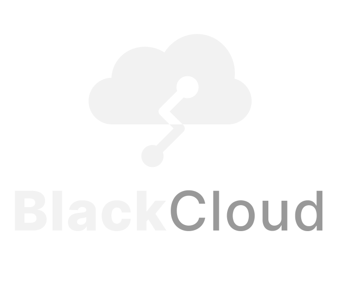
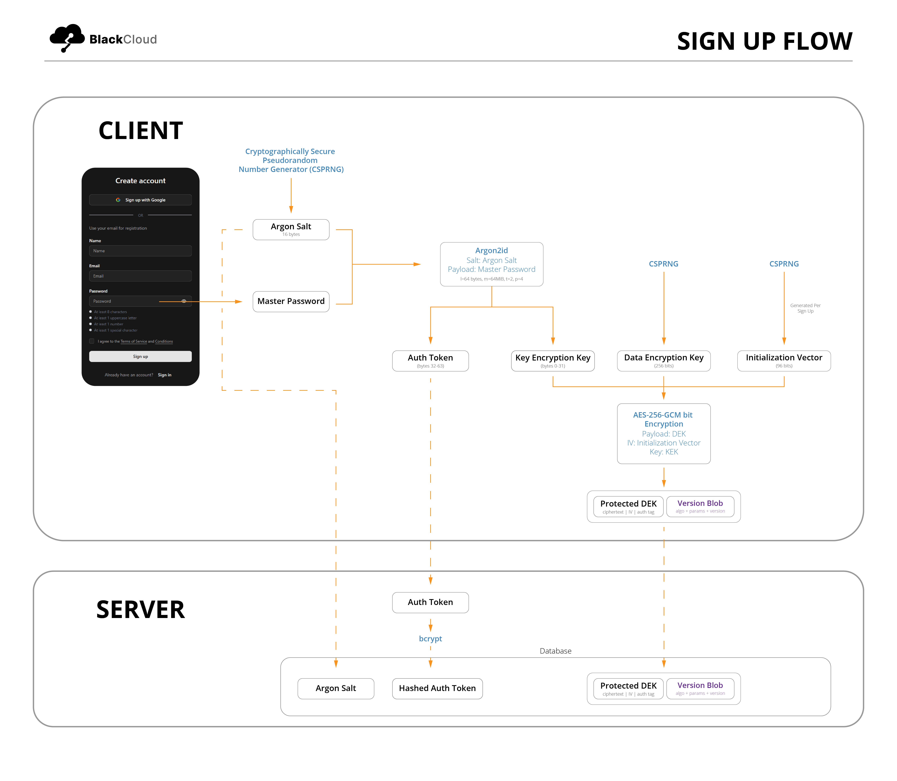
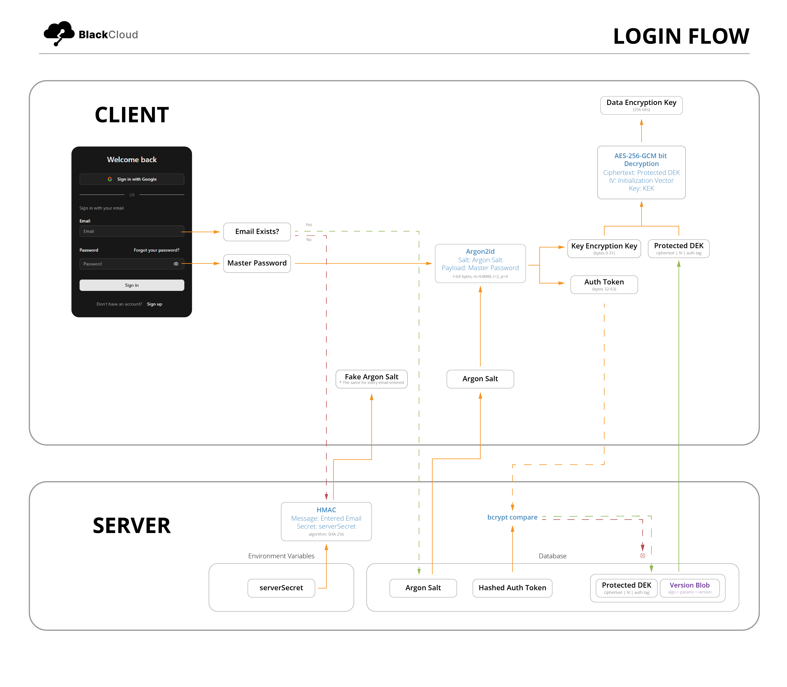
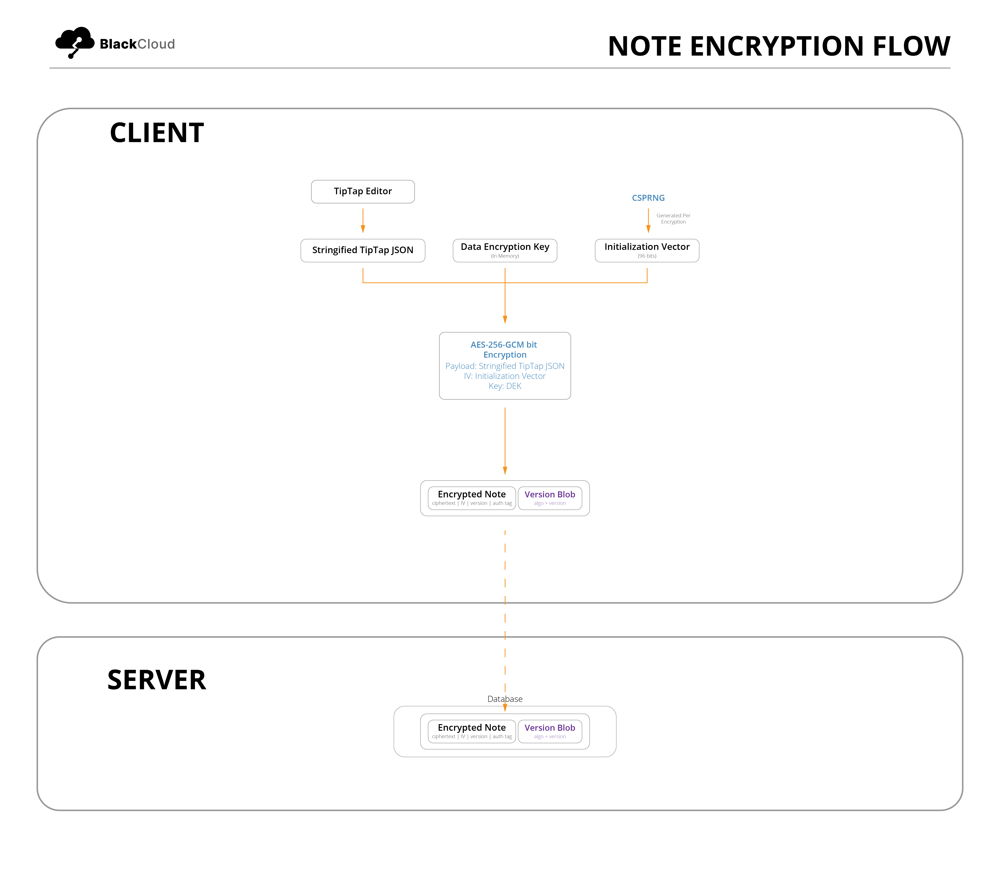
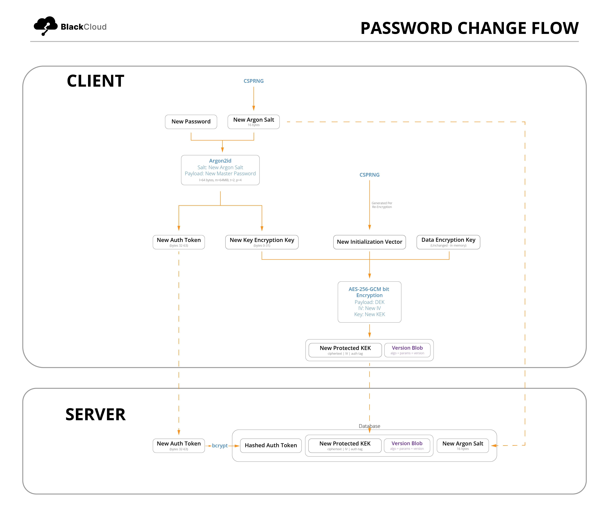

# BlackCloud Notes

**BlackCloud Notes** is a minimalist, **privacy-focused** note-taking app built on a client-side-heavy architecture.

## Core Philosophy

BlackCloud is built on one core belief: **Your data belongs to you**.

Any person should have the right to freely express their thoughts, ideas, and emotions without being traced or accessed by any corporation or government.

To maximize user privacy, all critical operations—including key generation, encryption, decryption, and processing—are performed locally on the user's device. By the time any data reaches the server, it is already encrypted and cannot be read or interpreted.

## Key Features

- **Client-side key generation**

  Encryption keys are generated and managed locally

- **End-to-end encryption**

  Notes are encrypted before leaving the device

- **Zero-knowledge backend**

  The server never has access to plaintext note content or the cryptographic keys required to decrypt it

- **Encrypted storage**

  Stored data is fully encrypted and unusable without the user's keys

- **Minimalist note-taking experience**

  No distractions or extra-fluff

## Threat Model

BlackCloud aims to protect against server breaches and DB leaks. Currently, it does not protect against a compromised client and malicious JS injections. If the client environment is compromised (e.g., XSS, malicious extensions, or supply chain attacks), all guarantees are void.

Users must ensure they use a strong, unique master password and store it securely. There is no recovery mechanism that preserves vault data if the master password is lost.

## Architecture

BlackCloud utilizes **envelope encryption**. In this practice, there are two encryption keys involved:

1. **Data Encryption Key (DEK)** - used to encrypt and decrypt user data

2. **Key Encryption Key** - used to encrypt and decrypt the DEK

This approach of encryption allows the data encryption key to be safely stored alongside the encrypted data and offer high performance and scalability. It also allows easy key rotation.

### Signup Flow

Upon signup, a 64-byte key is derived from the user’s master password using **Argon2id** (m=65536, t=2, p=4) with a randomly generated 16-byte salt.

This derived key is split into:

- **KEK (bytes 0–31)** – used to encrypt the DEK
- **Auth token (bytes 32–63)** – used for authentication

The auth token is sent to the server and hashed using **bcrypt** before being stored.

The authentication token is deterministically derived from the master password. While convenient, this design couples authentication and key derivation and may be revised in future iterations.

A random 256-bit **DEK** is generated on the client.

The DEK is then encrypted using the KEK with **AES-256-GCM**, producing a **protected DEK** that includes:

- ciphertext
- initialization vector (IV)
- authentication tag

This protected DEK is sent to the server and stored securely alongside metadata (e.g., algorithm version and parameters).

AES-GCM provides both confidentiality and integrity, ensuring the protected DEK cannot be modified without detection.

### Login Flow

The system checks if the entered email exists on the database. If the email exists, the server returns the stored Argon2id salt to the client. Otherwise, the server derives a deterministic fake salt using HMAC with a server secret, ensuring the same fake salt is always returned for the same unknown email. This ensures identical responses for existing and non-existing accounts, preventing attackers from distinguishing valid emails (enumeration attacks).

Upon successful login, a KEK is derived from the master password which can be used to decrypt the protected DEK, which allows the user to decrypt their protected vault.

### Vault Lock Feature

Upon refresh, the DEK is cleared from memory. The user must therefore re-enter their master password to unlock the vault to re-derive their DEK. The vault lock feature also has the added benefit of protecting the user content on refresh or page exit.

### Note Encryption and Decryption

BlackCloud Notes uses **TipTap** as its rich-text editor. Formatted contents from the TipTap editor is extracted as a JSON output. The JSON content is stringified and is subsequently encrypted using the DEK and a randomly generated 96-bit IV before being transmitted and stored to the database. For the decryption of notes, it is simply the reverse of this process.

The authentication tag ensures that any tampering with the ciphertext is detected and rejected during decryption.

IVs are generated using a cryptographically secure random source, are unique per encryption, and are never reused with the same key.

### Password Changes

When a user decides to change their master password, a new KEK and auth token have to be derived. This is where envelope encryption demonstrates its efficiency. Instead of having to re-encrypt the entire vault, only the DEK is re-encrypted. This makes password changes cheap and fast. There is, however, an important thing to note: password changes involve **two scenarios**:

1. The user knows their old master password and wants to change it

2. The user forgot their old master password and needs to recover their account

Scenario 1 is straight forward. Since the user can log in, the user can decrypt their protected DEK, re-encrypt it with their new derived KEK, and use their account as usual. Scenario 2 is a lot more complicated. Since the user cannot log in to their account, they have no access to their DEK. Therefore, **a new DEK** has to be generated and encrypted with the new KEK. In this scenario, **the user will lose all their old data** as they can no longer be decrypted. During password resets, all previously encrypted data becomes permanently inaccessible and is deleted from the database to keep the user vault clean of orphaned data. For account recoveries, the user is warned of this consequence before proceeding with the process.

## Live App

https://app.blackcloudhq.com

## Tech Stack

- Frontend: React, Typescript, TipTap, Zustand, TailwindCSS, ShadCN
- Backend: Node.js, Express, MongoDB, Mongoose
- Crypto: Web Crypto API, hash-wasm (Argon2id)

## Disclaimer

BlackCloud Notes is currently in its early stages (MVP).

While strong privacy principles are implemented, this app has **not undergone formal security audits**.

Use responsibly and avoid storing highly sensitive data until further validation.

## Security Considerations

- No protection against compromised client environments (XSS, malicious extensions)
- No forward secrecy (if DEK is exposed, all data is exposed)
- Metadata is not encrypted (e.g., timestamps, note sizes)
- Authentication is currently password-derived and may evolve
- No formal security audit has been conducted yet

## Issues and Feedback

Found a bug or have a suggestion? Feel free to open an issue or reach out.

## Contributing

This project is currently in MVP stage.

If you'd like to contribute, please open an issue first to discuss changes before submitting a pull request.

All contributions should align with the project's privacy-first and security-focused design principles.
